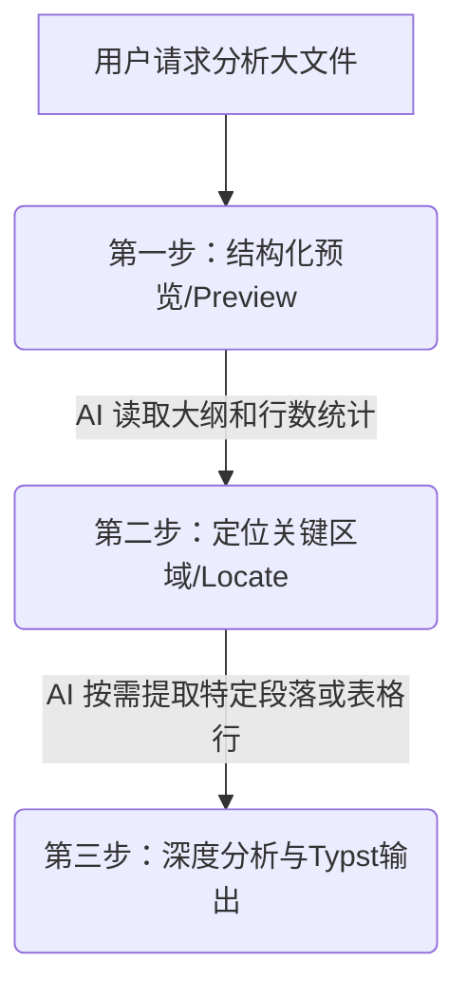

# Learned Skill 使用机制与 Token 优化研究报告

本报告针对用户关于“学得的全局技能的使用方法”以及“分析大型文档时的 Token 消耗与优化”进行了详细的技术分析。

## Verified Facts (已验证的事实)

### 1. 学得的 SKILL 运行与触发机制
当我们在全局配置路径（如 `C:\Users\Reaticle\.gemini\config\skills\office-parser`）下注册了一个 Skill 后，其触发机制如下：
- **触发方式**：您在日常对话中**不需要任何特殊的命令行或特殊语法**。您只需用自然语言发出指令（例如：“分析一下工作区里的验收函.docx” 或 “帮我把这个 Excel 表格里的数据做个汇总”）。
- **匹配机制**：Antigravity IDE 每次接收到您的 Prompt 时，会自动扫描已注册技能的 `SKILL.md` 属性定义（通过 YAML Frontmatter 中的 `name` 和 `description` 进行语义匹配）。一旦匹配成功，IDE 会自动将该 Skill 的具体使用说明（如何运行解析脚本、参数格式等）载入 AI 的当前上下文。
- **自动调用**：AI 读到 Skill 的说明后，会自主调用 `run_command` 运行对应的 Python 脚本对您的目标文件进行解析，并将解析结果作为输入进行分析。

### 2. 直接引用大文件对 Token 消耗的影响
- **直接引用的后果**：如果您直接将 10MB 的 Word（约数十万字）或包含数万行数据的 Excel 转换为纯文本并全部塞入大模型，会导致：
  1. **Token 消耗激增**：虽然现代双子座（Gemini）模型拥有高达 100 万至 200 万 Token 的上下文窗口，能够容纳整本书，但一次性读入大量文本会消耗大量 Token，从而增加 API 消耗与配额占用。
  2. **响应延迟变长**：Token 数量越多，模型的推理和生成速度就越慢。
  3. **注意力分散**：尽管模型支持超长上下文，但“大海捞针”能力仍可能因为噪声过多而受到轻微影响。

---

## Evidence Sources (证据来源)

1. **Antigravity Customization 规范**：系统文档中明确指出自定义 Skill 必须包含 `SKILL.md`（配置 name 和 description 用于触发），且 Skill 内部脚本可由 Agent 发现并执行。
2. **Office XML 结构特征**：
   - 现代 Office 文件经过解压后的文本数据量相比原压缩包（`.zip` / `.docx` / `.xlsx`）会膨胀数倍甚至数十倍。例如，一个 10MB 包含大量图片和图表的 `.docx` 解压后纯文本可能只有几十 KB，但如果全是文字的 10MB `.docx` 解压后纯文本会高达数百万字。

---

## Unverified Claims (未验证的声明)
1. **自动化分块检索的极端情况**：对于结构极其复杂且存在大量嵌套表格的超大 Excel，纯 Python 二进制流匹配分块读取可能在精度上有所偏差，需要结合实际案例调试。

---

## Research Notes (研究笔记：如何设计 Token 优化的 Office 分析技能)

为了在享受 Office 分析便利的同时，最大程度节省您的 Token 并加快响应速度，我们建议在打包 Skill 时采用以下 **“三步渐进式”** 策略：

### 1. 预览优先策略 (Previewing First)
脚本在解析时，默认只提取**大纲信息**和**预览片段**：
- **Word (`.docx`)**：优先解析并输出文档目录结构（TOC）、各级标题、以及前 1000 个字符。
- **Excel (`.xlsx`)**：优先输出 Sheet 清单、各 Sheet 的总行数/总列数、表头（第一行）以及前 10 行的数据样本。
*这样能让 AI 在消耗极少 Token 的情况下，先看懂这个文件的“骨架”。*

### 2. 定向局部提取 (Targeted Extraction)
当 AI 通过预览了解到文件结构后，如果需要解答您的具体问题，它会**按需发起二次读取**，例如：
- *“我看到了这个 Excel 有一个名为‘后续需求’的 Sheet，让我只提取这一页的第 5 到 15 行。”*
- *“这个 Word 的第三章是关于‘解决方案’的，我只读取第三章下方的段落。”*
我们的解析脚本可以通过参数（如 `--sheet`、`--range` 或 `--search`）支持这种定向读取。

### 3. 本地关键字过滤 (Local Search/Grep)
如果需要从海量数据中寻找特定信息，可以让 Python 脚本在您本地计算机上完成全文关键字检索，只将命中关键字的“上下文片段”返回给大模型。
*这在分析超大型 Excel 数据或大型合同文档时，能节省 95% 以上的 Token。*
