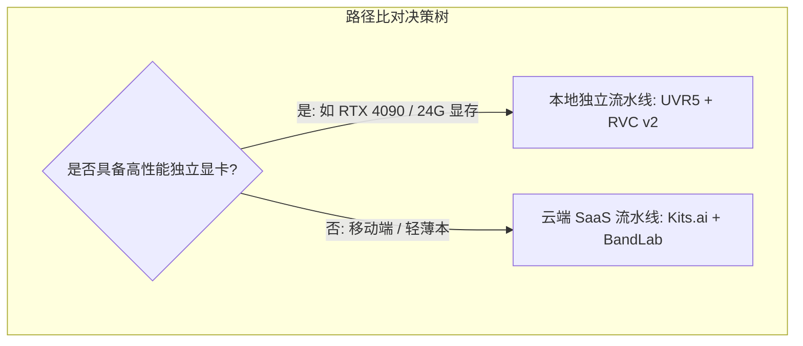
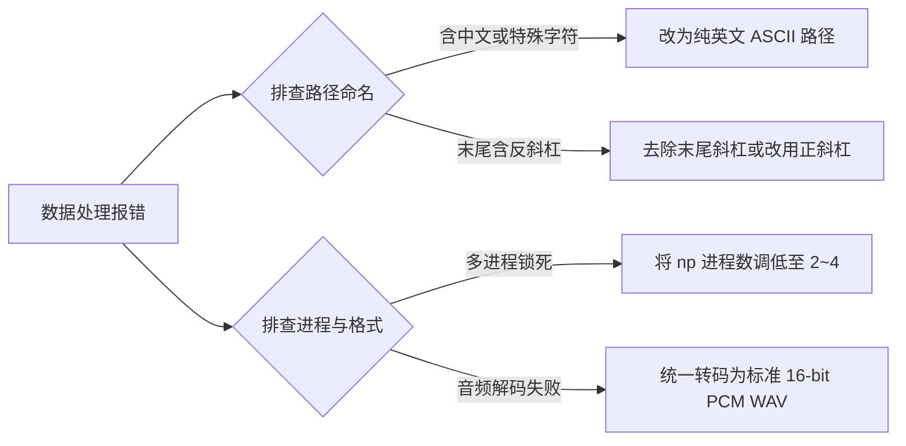

在多模态生成实践中，AI 音乐工程常面临两类典型困境：一是试图依赖单一通用大语言模型（如 GPT-4o、Gemini）端到端生成完整曲目，受限于会话式语音模块的声学先验，难以胜任复杂编曲与演唱；二是直接使用专用音乐生成工具生成全曲，但人声音色千篇一律，缺乏可控的创作者生物特征辨识度。

本文基于《一个天平落下之后》音乐工程方案，拆解大语言模型与音频渲染引擎的能力边界，梳理一条解耦“语义编译”、“旋律渲染”与“音色注入”的协作机制与落地路径。

---

## 一、 能力边界解构：大模型与音频引擎的模态分工

构建可复现的音乐生成流水线，核心在于厘清符号逻辑与声学生成在模态表征上的边界划分。

### 1. 大语言模型：定位于“符号编译与逻辑编导”
- **能力范畴**：具备深层语义提炼、严苛词汇过滤（如去除直白术语，置换为具象生活意象）、曲式结构（Verse/Chorus/Bridge）切分、以及音节数与韵脚控制能力。
- **失效边界**：多模态大模型的原生音频模块（Native Audio / TTS）设计目标是低延迟会话式语音，缺乏对多声部乐器织体、调性（Key）、BPM 节拍栅格以及复杂转音（Melisma）的声学先验，不适于直接承担音乐成品渲染。

### 2. 专用音乐生成引擎：定位于“高维声学渲染器”
- **能力范畴**：Suno、Udio 等工具基于大规模全曲多轨数据集训练，能一次性完成打击乐、低音（808 Bass）、键盘织体（Rhodes）与高表现力唱腔的混合渲染。
- **失效边界**：生成过程具有较强随机性，难以直接通过自然语言微调执行细粒度词汇置换和严格逻辑约束，需要上游提供高度结构化的提示词输入。

---

## 二、 机制设计：三层解耦的 AI 音乐工程架构

将音乐制作流程解耦为三个相互独立、参数传递明确的子系统：

### 阶段 1：语义提炼与元标签编译
将原始叙事（如关于规则冲突、边界确立与生活回归的思考）转化为工程输入，包含三道工序：
1. **意象置换**：通过对照表剔除直白行业词汇，转化为具象的物理载体（例如将文书与规则映射为“纸页、淡墨、关上的门”）。
2. **韵脚与节拍工程**：按目标风格（如 Contemporary R&B / Neo-Soul，BPM 82-88）规划音节密度与韵母分布（如 an/ang/en 韵系）。
3. **元标签注入**：在歌词段落中嵌入结构标记（`[Verse]`、`[Pre-Chorus]`、`[Melodic Rap Bridge]`、`[Outro]`）与乐器控制符（`[Fender Rhodes Solo]`、`[Vocal Harmonies]`），约束渲染引擎的段落走向。

### 阶段 2：端到端音频渲染与分轨解耦
1. 将编译后的歌词与风格提示词输入 Suno 或 Udio，生成完成度高的基底成曲。
2. **人声与伴奏解耦**：采用 UVR5（Ultimate Vocal Remover）中的先进模型（如 `BS-Roformer-Viperx-1297` 或 `MDX-Net`），将渲染好的成曲拆分为纯人声干声轨（`Vocals.wav`）与伴奏轨（`Instrumental.wav`）。
   - **技术价值**：提取出 AI 生成音频中完整的音准曲线、转音细节、呼吸声与节奏 Flow，为下游音色替换提供高精度的声学骨架。

### 阶段 3：歌声转换与个性化特征注入
歌声转换（RVC - Retrieval-based Voice Conversion）机制将“唱法技巧”与“声线音色”彻底解耦：
- **特征输入**：提供 5~10 分钟平稳朗读的日常说话音频。
- **模型推理**：RVC 提取原唱干声的基频（F0）与发音内容特征，在潜在特征空间中检索个人音色特征向量进行重构，输出兼具个人音色与原唱唱腔细节的人声轨。

---

## 三、 落地路径对照与关键参数调校

根据算力与环境条件，可选择本地独立部署或全云端协同两条实现路径：

| 维度 | 本地独立部署（高性能 GPU） | 云端轻量级 SaaS 链路 |
| :--- | :--- | :--- |
| **适用场景** | 批量生产、注重数据隐私、要求无损音质与微秒级调优 | 移动办公、零代码、免环境配置快速验证 |
| **分轨方案** | 本地 UVR5 (`BS-Roformer` / `MDX-Net`) | Suno "Get Stems" / VocalRemover 在线拆分 |
| **音色转换** | 本地 RVC v2 (RMVPE 算法) | Kits.ai / Weights.gg / Fish.audio |
| **混音母带** | 本地 Reaper / Audacity / FFmpeg 批处理 | BandLab Web Studio 在线工程与 AI 母带 |
| **综合耗时** | 训练 3~5 分钟，单曲转换仅需数秒 | 训练约 5~10 分钟，受网络上下行速度制约 |

### 核心参数调校要点（防机械感与失真）：

1. **音高提取算法（Pitch Extraction）**：选用 **`rmvpe`**。在处理滑音与转音时，对微弱伴奏残余和噪点的抗干扰能力显著优于传统的 `pm` 或 `harvest`。
2. **变调参数（Pitch Shift）**：
   - 同性别转换设为 `0`；
   - 原唱为女声、目标转换为男声时，基础参数设为 `-12`（结合曲目调性微调）。
3. **特征检索占比（Index Rate）**：保持在 **`0.65 ~ 0.80`**。过低会导致音色与目标声线偏离，过高则容易引入日常说话中的发音生硬感，影响旋律流动性。
4. **清辅音与呼吸声保护（Protect Voiceless Consonants）**：设为 **`0.33 ~ 0.50`**。保留气声是维持自然人声质感的关键，设为 0 易导致高频机械电音感。

---

## 四、Windows 环境异常

在本地执行数据清洗与模型切片时，底层 C++/Python 混合调用常因系统环境差异引发中断。以下为高频报错的触发条件与应对措施：

1. **路径解析崩溃（`run_preprocess_dataset` 异常）**：
   - **诱因**：Windows 下路径包含中文字符或末尾带反斜杠 `\`（在命令行传递时引发 `\"` 转义错误）。
   - **防范**：数据集目录与音频文件统一使用纯英文命名（如 `D:/rvc_dataset/voice_01/`），路径分隔符优先采用正斜杠 `/`。
2. **多进程并发锁死（`BrokenPipeError`）**：
   - **诱因**：Windows 系统进程衍生机制（Spawn）在调度大量 CPU 线程时发生句柄冲突。
   - **防范**：在 WebUI 中将切片进程数（`np`）主动降级至 `2` 或 `4`，避免耗尽系统线程资源。
3. **音频文件不兼容（0 files processed）**：
   - **诱因**：输入了被重命名为 `.wav` 的 MP3 或 32-bit Float 音频。
   - **防范**：预先统一转码为标准的 16-bit / 44.1kHz PCM WAV 单声道文件。

---

## 五、 创作流程的分工演进

1. **重心前置至语义与架构编导**：将生产精力集中于上游的**叙事结构把控、意象系统设计与提示词元标签编译**，将声学实现交给专业渲染与转换模型。
2. **构建模块化声音资产库**：按情绪状态（如激昂、低沉、轻柔）分类采集语音样本，分别微调对应的 RVC 模型分支，形成可插拔的声线资产组合。
3. **沉淀标准化工作流基线**：跑通“Suno 渲染 -> UVR5 分离 -> RVC 替换 -> 伴奏混音”的参数闭环，记录最适 Index Rate 与变调数值，形成可复用的工作流。

<audio controls preload="none" style="width: 100%; max-width: 400px;">
  <source src="https://github.com/TREYWANGCQU/blog.reaticle.com/raw/refs/heads/mine/assets/reaticle_the_evening_breeze.wav" type="audio/mpeg">
  您的浏览器不支持原生音频播放，请<a href="https://github.com/TREYWANGCQU/blog.reaticle.com/raw/refs/heads/mine/assets/reaticle_the_evening_breeze.wav">下载音频</a>。
</audio>

**国内网易云**:[点击跳转->](https://music.163.com/song?id=3421979545&uct2=U2FsdGVkX18bQ0zHOKq9zKb8W6ZuoB1Do4bGSS6YVNo=)
<iframe frameborder="no" border="0" marginwidth="0" marginheight="0" width=330 height=86 src="//music.163.com/outchain/player?type=2&id=3421979545&auto=1&height=66"></iframe>

