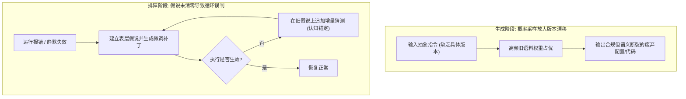
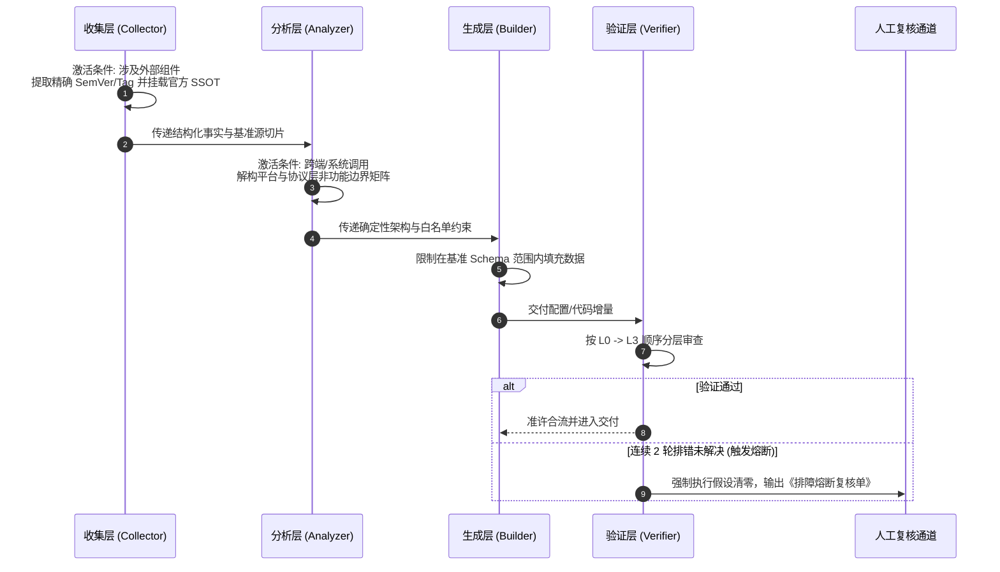

在《Headscale实践复盘：版本漂移、混杂文档与AI协同的控制闭环》中，我记录了私有组网建设中遭遇的典型工程阻断：命令语法重构（`namespace` 到 `user`）、配置字段静默漂移（`derp.paths` 到 `derp.urls`），以及异构操作系统对单标签域名的解析黑洞。

这些问题的暴露引出了更深层的工作流矛盾：大语言模型（LLM）具备强大的代码与配置编写能力，但其内在的概率采样特征会优先输出互联网上高频沉淀的旧版语料；在排查故障时，一旦未能命中断裂根因，AI 往往倾向于顺着上一轮失效假设继续做表层微调，陷入“反复错误分析”的认知死循环。

若要将偶发性的排障教训沉淀为稳定可靠的研发基础设施，关键在于重构上游的 Agent 协作链路。同时，这套全局工作流还承担着代码开发、算法推导、文档排版等多种任务，升级方案绝不能退化为只适用于特定网络工具的狭隘补丁，而应在保全通用适配性的前提下，构建具有自愈与熔断能力的确定性控制闭环。

---

## 1. 现象解构：AI协同下的两类致命认知失真

分析基础设施维护中的失误，AI 表现出的工程脆弱性主要集中在两个不同阶段：



### 1.1 概率采样放大版本漂移（生成期失真）
当提示词仅给出通用语义（如“生成 Headscale 配置文件并开启 MagicDNS”）时，大语言模型检索参数空间内的关联关联项。历史上关于旧版字段的讨论体量庞大，其统计概率远高于刚随 Release Tag 发布的新版规范。模型在缺乏宿主机真实版本感知的前提下，会自信地交付一份结构优美、解释完备但混合了多个历史大版本的“缝合配置”。

### 1.2 假说未清零引发排障死循环（核验期失真）
当配置下发遇到静默失败（如 Windows 客户端因 NRPT 规则拒绝解析单标签域名）时，终端并未抛出显式语法错误。此时若要求 AI 进行排错，AI 的标准反应是在应用层寻找原因：反复修改监听端口、调整 DNS upstream 列表、重写分流规则。

这种行为的微观机制是**认知锚定**：AI 默认当前系统架构与应用层参数有效，把精力消耗在局部参数的排列组合上。只要底层的系统契约冲突没有被揭示，整个排查链条就会在错误的方向上无限空转。

---

## 2. 架构设计：正交解耦的分权控制闭环

为了阻断上述失真，必须在既有的全局工作流角色（Collector、Analyzer、Builder、Verifier、Reviewer）中植入防御机制。

为了不破坏工作流对纯文档编排、通用算法或脚本任务的通用适配性，所有新增规则均采用**条件触发与正交扩展**设计：仅当任务涉及外部运行时、异构系统依赖或进入排障分支时激活，普通任务零额外负担。



---

## 3. 微观机制：四维工程落地规范

按照 **条件（Condition）、能力（Capability）、行动（Action）、边界（Boundary）** 四维模型，将方案拆解为可操作的微观机制：

### 3.1 机制一：条件化版本锚定与基准源注入（SSOT Schema Injection）

- **条件（Condition）**：
  任务涉及第三方独立服务、中间件、网络协议组件或强版本依赖库时触发。纯语言内置语法、独立数学算法与通用文档排版不激活。
- **能力（Capability）**：
  确立单一事实来源（SSOT）的识别与绑定能力，将版本约束由定性描述转化为结构化配置样本。
- **行动（Action）**：
  1. `Collector` 在盘点资产时，强制记录具体运行版本号（SemVer、Container Tag 或 Git Commit），禁止使用 `latest` 等模糊指代；
  2. 提取目标版本官方发布的配置样本（如 Release 附带的 `config-example.yaml` 或官方接口定义）切片，作为基准资产登记于上下文；
  3. `Builder` 在生成交付物时，仅被允许基于官方基准样本做差异填充，严禁引入未在样本中出现的键名与层级结构。
- **边界（Boundary）**：
  若组件处于调研阶段且物理版本未知，必须在 `Collector` 的 `Unknown Information` 中列为高危未确认事项，走澄清流程，不可跳过此项直接让 `Builder` 自由发挥。

### 3.2 机制二：隐式协议栈与宿主边界契约（Boundary Matrix）

- **条件（Condition）**：
  交付物运行涉及跨平台通信、系统底层网络接管（TUN/TAP）、名称解析策略或特权系统服务时触发。
- **能力（Capability）**：
  识别宿主操作系统的底层实现差异与刚性限制，将 RFC 规范转化为生成约束。
- **行动（Action）**：
  `Analyzer` 在输出系统架构时，必须单独设立系统边界约束矩阵，重点罗列非应用层的物理限制：
  - 域名体系规范（如 RFC 1535/6761 要求：杜绝无点号单标签顶级域，强制使用二级或子域名结构）；
  - 操作系统专用拦截机制（如 Windows NRPT 规则、Apple `mDNSResponder` 限制）；
  - 回退与转发链路完整性（禁止留空上游服务器导致本地虚拟代理挂起）。
- **边界（Boundary）**：
  严禁将“控制端软件支持某参数”等同于“接入端操作系统能按预期解析该参数”。契约必须包含端到端全链路。

### 3.3 机制三：L0~L3 分层核验体系（Layered Diagnosis）

- **条件（Condition）**：
  在 `Verifier` 中对存在缺陷、报错或异常行为的系统进行诊断定位时触发。
- **能力（Capability）**：
  建立单向递进的排错逻辑树，切断跨层级胡乱推断的路径。
- **行动（Action）**：
  核验必须严格自下而上推进，前置层级未通过前，禁止跨级分析后续层级：

| 诊断层级 | 审查核心 | 判据与动作 |
| :--- | :--- | :--- |
| **L0 基准层** | 版本与配置 Schema 吻合度 | 比对当前配置字段与对应版本官方 Sample，存在废弃字段或非法嵌套则立即终止，重写配置 |
| **L1 运行层** | 进程生命周期与日志 | 审查 stdout/stderr、退出状态码、监听端口占用；缺乏日志证据时拒绝采纳假设 |
| **L2 契约层** | 操作系统与网络协议刚性规范 | 审查是否触碰平台底层解析机制（单标签域名、防火墙拦截、路由表冲突） |
| **L3 业务层** | 应用功能与业务逻辑参数 | 仅在前三层完全绿灯后，方可调整路由策略、ACL 规则或应用自定义逻辑 |

- **边界（Boundary）**：
  排障过程中禁止首先调整 L3 参数来掩盖 L0 或 L2 的底层断裂。

### 3.4 机制四：双轮失效强制清零熔断与结构化复核（2-Fail Circuit Breaker）

- **条件（Condition）**：
  针对某一故障现象，在应用了一次代码/配置修复补丁后，问题现象仍未消除时触发计数。
- **能力（Capability）**：
  强制中断 AI 在失效假设上的局部优化，重置认知原点并升级至人机协作层。
- **行动（Action）**：
  1. **熔断阈值设定**：针对同一故障，连续 2 轮排错未见效即触发强熔断；
  2. **假设清零（Ground Zero Reset）**：宣告此前关于该故障的所有中间推论全部作废，禁止在原有假设路径上提交第 3 次增量补丁；
  3. **输出标准化复核单**：停止自由文本输出，直接由 `Verifier` 输出规范卡片并移交人工。

```markdown
> [!CAUTION]
> ### 触发排障熔断复核单
> - **阻断现象**：[确切的不可达现象或报错文本]
> - **已推翻假设**：
>   1. [假说 A，如：监听端口配置冲突（已验证服务正常绑定端口）]
>   2. [假说 B，如：上游 DNS 代理未响应（已验证直接发包正常返回）]
> - **可疑底层冲突**：[指向 L0 或 L2 的深层矛盾，如 Windows NRPT 单标签域解析规避]
> - **单步探测指令**：
>   ```powershell
>   Resolve-DnsName -Name "node.reaticle.internal" -Server 100.100.100.100
>   ```
> - **确定性判定准则**：
>   - 若返回正常 IP，说明 L0/L1 恢复，问题在客户端后缀补全；
>   - 若仍返回查询失败，说明虚拟网卡驱动未接管流量，需排查终端网络配置。
```

- **边界（Boundary）**：
  复核单中严禁使用“请检查你的网络环境”等无着落的模糊表述，必须交付具体宿主机可执行的单步探测命令。

---

## 4. 责任与执行矩阵

为保证机制在实际协作中不流于形式，明确各环节的分权执行边界：

| 机制模块 | 责任角色 | 触发条件 | 执行动作 | 失效与升级路径 |
| :--- | :--- | :--- | :--- | :--- |
| **版本锚定与基准源** | Collector / Builder | 依赖外部运行时、框架或服务 | 收集确切 SemVer/Tag；抓取官方 Sample 子树注入上下文；基于 Sample 做白名单生成 | 若版本未知，在 `Unknown Information` 阻断，路由至人工或 `/researcher` |
| **底层协议边界矩阵** | Analyzer | 存在异构系统、跨平台交互或网络调用 | 输出非功能性协议约束（RFC、OS 内核机制、防火墙行为） | 若缺乏平台文档支持，设为待验证假设，由用户确认 |
| **分层排查推进** | Verifier | 故障排障、逻辑纠错分支 | 按 L0（Schema）$\rightarrow$ L1（日志）$\rightarrow$ L2（协议）$\rightarrow$ L3（业务）单向诊断 | 发现底层不匹配时直接终止应用层分析 |
| **双轮失效熔断** | Verifier | 同一故障连续 2 轮修改无效 | 强制终止自动修改，清零已有假设，输出结构化复核单 | 移交人工处理，等待人工注入确定性事实后重开上下文 |

---

## 5. 演进路径与行动落地

这一套对抗版本漂移与循环误判的控制闭环，并非否定大语言模型的生成效率，而是为其设定精确的轨道约束：

1. **工作流定义文件就地更新**：
   将上述机制分别增量注入现有的 `collector.md`、`analyzer.md`、`builder.md` 与 `verifier.md` 中。保持既有格式不变，以非破坏性条款保障纯文本与常规代码项目的无缝运行。
2. **静态校验工具前置集成**：
   在自动化测试链条中，引入强依赖特定版本的 Schema 校验步骤（例如使用对应软件的 `--dry-run`、`config test` 或 JSON/YAML Schema 工具），在配置落地前完成 L0 层级的机器判定。
3. **沉淀版本敏感与平台陷阱库**：
   将如“单标签域名被 Windows/iOS 规避”、“Tailscale/Headscale 命名实体重大重构”等确定性经验，固化为特定领域的局部规则项，使后续排查直接命中 L2 事实，避免重复消耗上下文与推理步数。

让生成归生成，让契约归契约。在工程实践中，只有通过确定性的规则切断模糊概率的空间，AI 工具才能真正从“需要时刻提防的概率模型”转变为“值得信赖的工程助手”。
