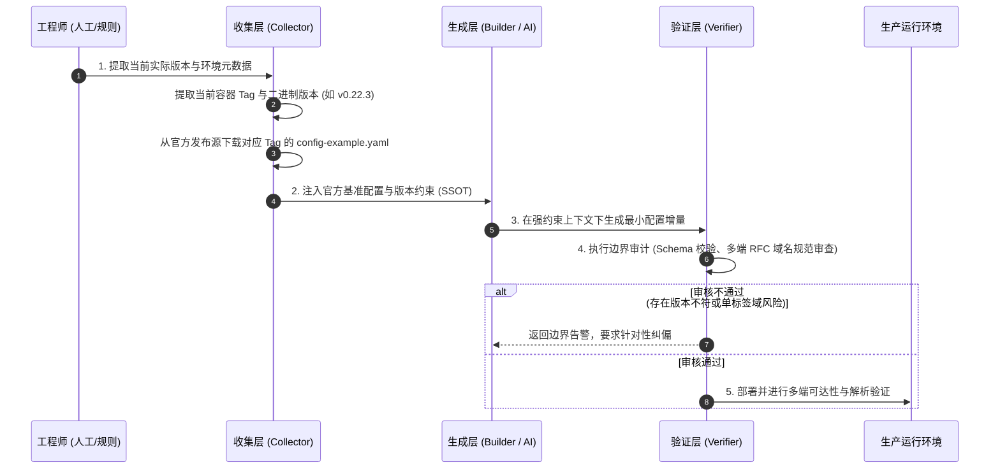

在近期的网络基础设施改造中，我针对 Headscale 展开了私有化组网的深入实践：搭建私有控制面、部署 DERP 中继、接入全平台客户端，并尝试通过 MagicDNS 实现内网自动域名寻址。

在预期中，这类任务拥有明确的技术协议与成熟的开源生态，借助现代 AI 编程辅助工具，应当能平滑地完成配置下发与验证。然而在实际工程推进中，排障耗时远超设计耗时，数个基础配置反复出现预期外的失效与报错。

排查链路最终揭示的问题成因并不来自复杂的网络拓扑，而是一个贯穿软件工程历史的经典陷阱：**技术依据与特定运行版本发生脱节，混杂的历史文档与二手资料构成了干扰源；而在引入 AI 辅助后，这一问题非但没有自动缓解，反而由于大语言模型的概率采样特征被成倍放大。**

本文复盘这一实践过程，解构技术文档混杂在人工时代与 AI 时代的传递机制，并给出针对版本漂移的工程控制方案。

---

## 1. 现象复盘：配置失效的具体切片

在部署与联调 Headscale 的过程中，几次典型的故障阻断集中在以下场景：

### 1.1 命令语义与实体模型的断裂（`namespace` vs `user`）

在参考社区资料和 AI 生成的初始化脚本时，大量指令依然使用形如：

```bash
headscale namespaces create default
headscale nodes register --namespace default --key <node-key>
```

然而在当前环境部署的 Headscale 二进制（或对应容器版本）中，命令行直接抛出未知参数或子命令错误。

查阅特定版本的官方变更记录后可以发现：Headscale 在特定版本演进中，将沿用已久的 `namespace` 实体彻底重构为 `user`，所有 CLI 子命令与数据表结构同步迁移（例如重构为 `headscale users create default`）。但由于历史文章留存量庞大，AI 生成的代码与网络博客仍大比例输出旧版语法。

### 1.2 配置层级与键名迁移的静默失败

在构建私有中继（DERP）与路由规则时，`config.yaml` 经历了多轮微小但致命的键名重构：
- 旧版本文档中常见的嵌入式中继配置与外置 `derp.yaml` 声明方式存在差异；
- 在部分小版本中，字段由 `derp.paths` 调整为 `derp.urls` 与嵌套定义，格式一旦错位，服务在启动加载时将直接拒绝解析或静默忽略自定义 DERP 区域，退化为默认公网节点；
- DNS 部分的 `nameservers` 配置从扁平列表演变为 `split` 与 `global` 的分流字典。

这些变更未能在通用的技术提问中被自动化提示，导致调试过程在语法正确但语义失效的假象中徘徊。

### 1.3 跨平台底层网络栈的隐式契约（单标签域名的解析黑洞）

为了内网访问便利，配置中曾将 MagicDNS 的基础域名设为短名称：

```yaml
# /etc/headscale/config.yaml
dns:
  magic_dns: true
  base_domain: reaticle
  nameservers:
    global: []
```

在配置校验中，YAML 格式完整无误，Headscale 顺利启动，且在 Linux 控制端能正常查到节点信息。但当 Windows 客户端、iPhone 及 iPad 接入后，所有设备均无法通过 `hostname.reaticle` 或短域名完成节点通信。

深入系统网络栈排查后，发现各客户端平台的解析机制存在刚性限制：
1. **Windows NRPT 规则限制**：Windows 系统的名称解析策略表（NRPT）对于没有点号（`.`）分隔的单标签域名（Single-Label Domain）存在特殊的后备解析规则，默认将其送往 NetBIOS / LLMNR / mDNS 广播，而不会顺利交由虚拟网卡的 DNS 处理；
2. **iOS / iPadOS NetworkExtension 约束**：Apple 移动操作系统的网络扩展框架在处理 VPN 下发的搜索域时，其底层的 `mDNSResponder` 不对单标签域执行单播搜索域自动补全，缺少点分二级结构直接被系统判定为非法域并丢弃；
3. **上游 DNS 代理挂起**：将 `nameservers.global` 设为空列表时，部分客户端的虚拟 DNS 转发器（`100.100.100.100`）缺少默认递归锚点，导致系统级 DNS 调度器拒绝接管。

这一问题表面看似是“MagicDNS 不可用”，其真正机理是**配置生成方未能感知特定平台网络栈的 RFC 与系统级契约**。

---

## 2. 溯源分析：从人工检索陷阱到 AI 概率放大

回溯过去的手工开发经历，上述问题并不陌生。技术人员在处理非主流工具链或快速迭代的基础设施时，绝大多数无效耗时都集中在“找错文档、对错版本”。

这一现象在人工编程与 AI 协作两个阶段呈现出不同的诱因与表现：

| 阶段 | 典型信息流动方式 | 关键瓶颈与失效机制 | 错误形态 |
| :--- | :--- | :--- | :--- |
| **人工检索时代** | 搜索引擎、StackOverflow、个人博客、旧版 GitHub Issue | 检索依靠关键词匹配，缺乏时间与版本的有效约束；文章作者通常省略依赖的具体 semver，读者进行无意识拼装 | **显式报错**：代码或命令直接在终端执行报错，排查靠人工比对官方 CHANGELOG |
| **AI 协同时代** | 预训练权重检索、RAG（若未绑定特定版本源）、上下文推断 | 训练语料是跨越数年互联网数据的**时间混合体**；高频陈旧用法的语义概率高于刚发布的规范；缺乏执行环境版本反思 | **伪确定性输出**：AI 以极度自信的口吻交付结构合规、解释详实，但混合了多个大版本特征的代码 |

### 人工时代的断层机理
在人工时代，开发者通过搜索引擎获取技术资料。Google 或百度在排序时倾向于将高点击量、长期沉淀的优质博客推至首页，但这些内容往往记录于软件发布的初期阶段（如 Headscale v0.15 或 v0.18 时期）。
开发者若未在第一时间核查文章发表日期以及当时对应的软件 Release Tag，便会将三篇不同时期文章中的配置片段合流至同一份配置文件中，形成“缝合式配置”。

### AI 时代的放大机理
在借助 AI 编程时，若仅仅给出一个宏观指令（例如“为我编写一份 Headscale 的 Docker Compose 和 config.yaml，并开启 DERP 与 MagicDNS”），大语言模型会基于其注意力机制在整个参数空间内提取关联词：
- 历史上讨论 `namespaces` 的语料数量远多于最近版本更名后的 `users`；
- 网络上讨论旧版配置层级的回答被反复引用，获得了更高的权重先验；
- AI 没有内置“当前宿主机实际安装了什么版本”的先验事实，它默认输出“统计概率上最典型”而非“当前环境契约上最精准”的内容。

最终产出的交付物，虽然行文规范、排版优美，却包含着由于时间漂移带来的系统缺陷。这不仅没有免除人工校对的工作量，反而因为输出的完整度掩盖了局部版本矛盾，增加了排查成本。

---

## 3. 机制推演：系统协议栈的确定性与版本约束

网络基础设施与应用层业务开发的一大区别在于：**它与操作系统内核、网络栈驱动和协议标准直接交互，不存在任何模糊容忍空间。**

我们可以将版本失效的机制拆解为四个工程维度：

```mermaid
flowchart TD
    subgraph S1 [1. 明确环境条件 (Condition)]
        C1["精确运行环境: Linux Kernel 6.x + Docker"]
        C2["目标二进制版本: Headscale v0.22.3"]
        C3["客户端平台覆盖: Win11, iOS 17+, Linux"]
    end

    subgraph S2 [2. 契约能力边界 (Capability)]
        CAP1["Headscale 控制面 API 与 CLI 规范"]
        CAP2["RFC 1535/6761 多级私有域名解析"]
        CAP3["Tailscale 客户端网络接管能力 (NRPT/scutil)"]
    end

    subgraph S3 [3. 执行动作要求 (Action)]
        A1["版本绑定: 锁定 Tag, 读取官方示例"]
        A2["Schema 静态校验: 拒绝跨版本字段拼装"]
        A3["多端环境测试: 验证短域名与 FQDN 解析路径"]
    end

    subgraph S4 [4. 安全与运行边界 (Boundary)]
        B1["拒绝单标签顶级域名 (Single-Label Domain)"]
        B2["保持对宿主机既有 DNS/DoH 链路的隔离"]
        B3["禁止将未经验证的 AI 编排脚本直接运行于宿主机"]
    end

    S1 --> S2
    S2 --> S3
    S3 --> S4
```

1. **条件（Condition）**：
   - 系统运行不仅依赖控制端软件（Headscale v0.22.3），同时依赖节点端客户端（Tailscale v1.60+）以及异构宿主系统（Windows NT 内核、Darwin 内核、Linux Netfilter）。
   - 任一端点变更其协议交互细节，都会打破整体通信假设。

2. **能力（Capability）**：
   - Headscale 具备下发 DNS 策略与路由规则的能力，但**不具备重写客户端操作系统网络协议栈实现规范的能力**。
   - 客户端只能在操作系统允许的框架内实现流量拦截（如 Windows NRPT 规则、iOS NetworkExtension）。

3. **行动（Action）**：
   - 运维动作需要严格遵循与目标版本匹配的操作手册，将参数限定在已验证的命名空间与字段架构内。

4. **边界（Boundary）**：
   - 越过版本契约使用未适配参数，轻则导致特定功能不生效，重则导致客户端无法更新网络配置陷入循环重试，甚至瘫痪本地正常的公网 DNS 查询。

---

## 4. 工程实践：构建对抗版本漂移的控制闭环

为了阻断混杂文档与 AI 幻觉引发的连锁故障，我们在后续实践中调整了工作模式，构建了包含三个关键节点的控制闭环：



### 4.1 机制一：版本锚定与官方资产注入（Version Anchoring & Schema Injection）

**执行规则**：
- 在调用 AI 或启动编排任务前，禁止使用 `latest` 或不带版本号的模糊提示词；
- 将具体运行的镜像版本（如 `headscale/headscale:v0.22.3`）作为前置约束写入提示词；
- **强制抓取官方单一可信源（SSOT）**：直接从 GitHub Release Tag 或对应容器镜像的 `/etc/headscale/config-example.yaml` 导出标准配置模板，作为上下文直接输入。

**执行边界**：
- 当官方配置文件存在数千行时，不应全文盲目投喂，而应抽取与当前修改项直接相关的子树（如仅抽取 `dns` 或 `derp` 块），避免超长文本稀释注意力。

### 4.2 机制二：多平台网络规范的负向审查

在设计配置时，将平台边缘限制转化为设计规范：

1. **域名合规化**：
   - 严禁使用无点号的单标签顶级域名（如 `base_domain: reaticle`）；
   - 统一采用点分二级或多级私有域名（如 `base_domain: reaticle.internal` 或 `vpn.home.arpa`），确保满足 Windows NRPT 与 iOS `mDNSResponder` 的解析前缀要求。

2. **DNS 兜底保护**：
   - 避免将 `nameservers.global` 留空导致虚拟代理无路可走；
   - 明确指定私有局域网网段的上游解析器或公共解析节点，维持客户端解析链路的稳定。

### 4.3 机制三：事实、生成与校验的分权设计（Collector-Builder-Verifier）

借鉴模块化工程思想，在技术运维与编码中确立职责分工：

1. **事实收集（Collector）**：
   - 负责采集生产服务器当前安装的确切版本号（`headscale version`、`docker image inspect`）、当前客户端版本号，以及该版本对应的官方参数定义；
   - 职责范围仅限于“陈述事实”，不进行推理。

2. **配置生成（Builder）**：
   - 仅在 Collector 提供的既定事实与 Schema 范围内填充业务数据（如 IP 段、端口、私有域名）；
   - 禁止凭空发明不存在于基准配置中的配置项。

3. **独立验证（Verifier）**：
   - 在配置落地前执行非功能性审查：该语法是否属于过往已废弃规范？域名是否违反操作系统解析惯例？是否可能破坏客户端现存的 DoH 链路？
   - 审查通过后，方可推送到宿主机执行部署。

---

## 5. 总结与后续演进

回顾整个 Headscale 的组网实践，技术栈越是深入底层网络，对精确度的要求就越严苛。

在传统编码时代，开发者的痛点是“在繁杂的过时网文中筛选有效信息”；在 AI 辅助时代，挑战转变为“防止高置信度的概率模型用过时信息覆盖精准契约”。工具的演变并没有削弱技术人员对事实源的掌控要求，反而对输入约束与边界防御提出了更高的标准。

下一步的演进路径将重点聚焦于配置生成的自动化防护：
1. **自动化 Schema 校验**：在 CI 流程中引入基于特定版本 Headscale 的配置校验工具（如利用 `headscale config validate` 或自定义 JSON Schema 进行前置门禁）；
2. **多端自动化探测集**：在测试机群中固化涵盖 Windows、macOS 与移动端的自动化测试脚本，验证真实网络栈下的解析行为；
3. **沉淀版本敏感知识库**：将特定组件在跨大版本跃迁时的 Breaking Changes 固化为可供 AI 工作流调用的结构化规则库，从源头切断“旧版幽灵代码”的生成。

在技术复杂性持续提升的今天，唯有将“版本精确性”提升为工程的第一守则，才能让生成式工具真正成为稳定高效的生产力基础设施。
